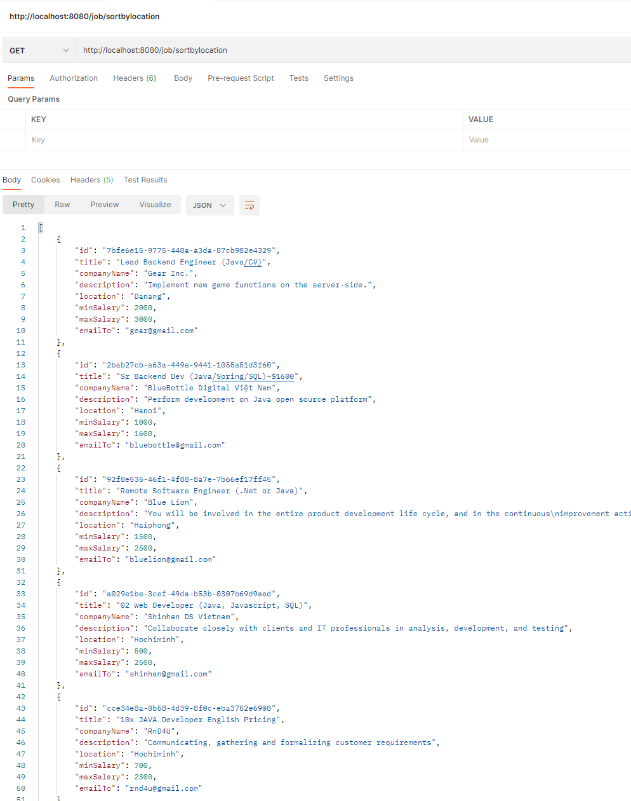
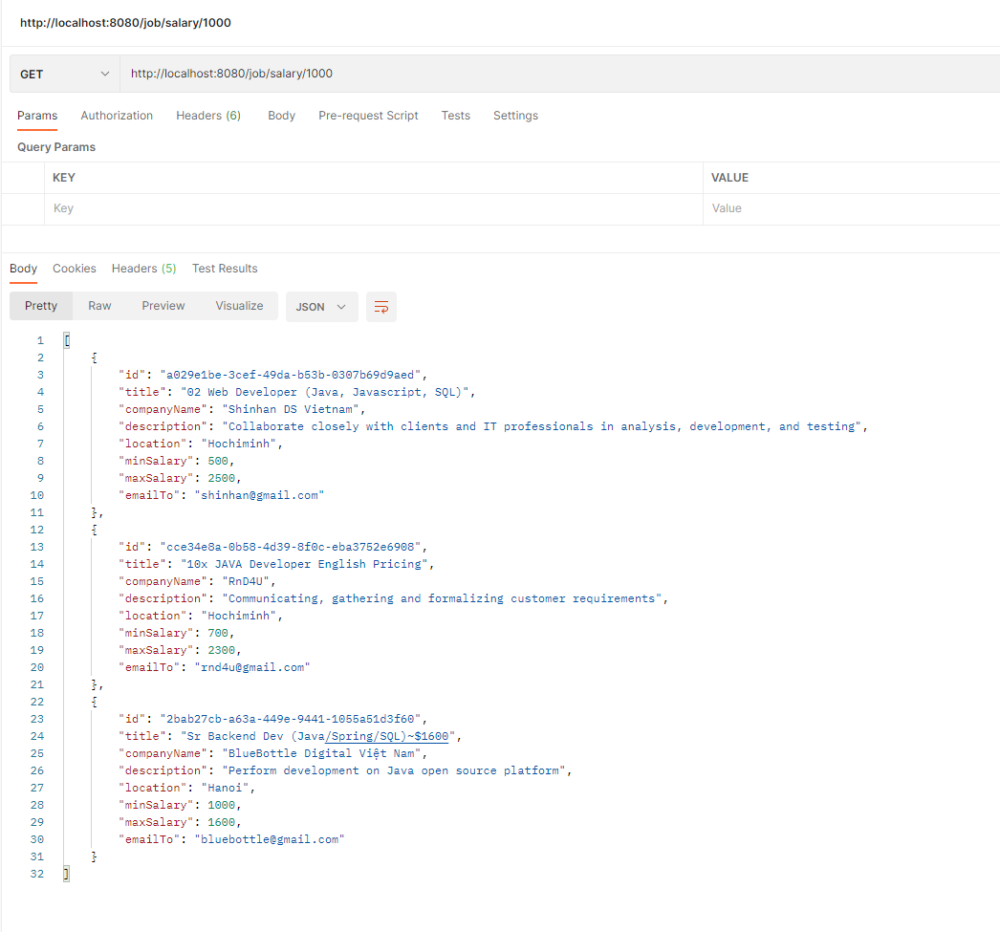
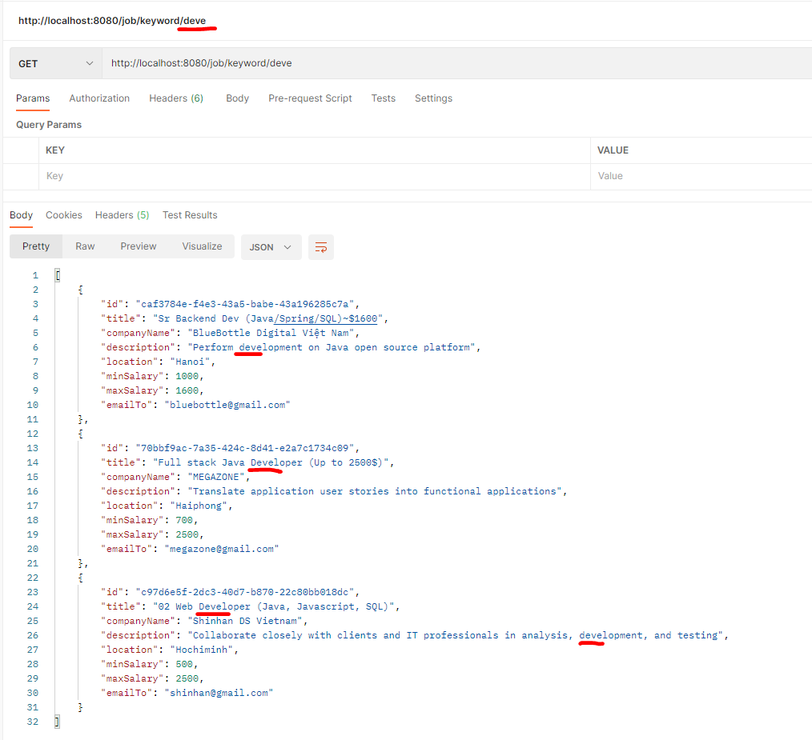
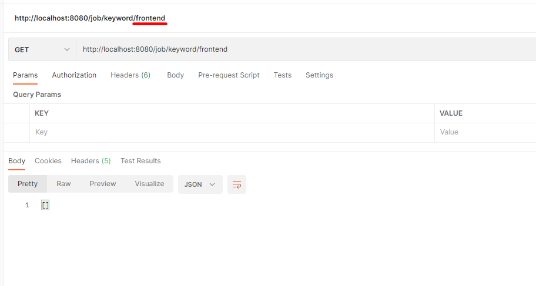
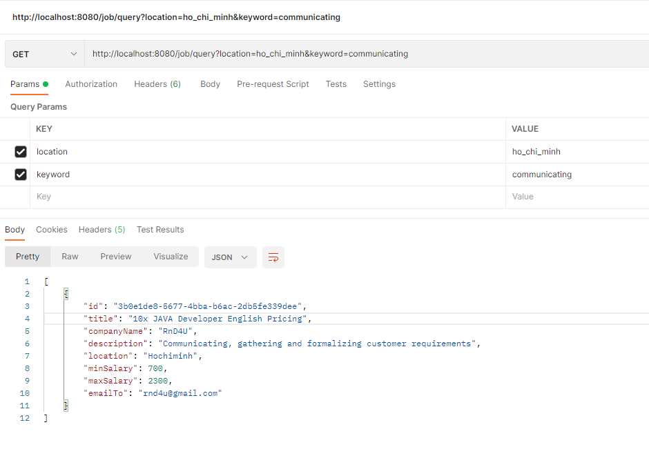

## DIỄN GIẢI CODE JOBHUNT

1. http://localhost:8080/job/sortbylocation: sắp xếp danh sách job theo thành phố tuyển

```java
public List<Job> sortJobByLocation(ConcurrentHashMap<String, Job> jobs) {
        List<Map.Entry<String, Job>> list = new ArrayList<>(jobs.entrySet());
        Collections.sort(list, new Comparator<Map.Entry<String, Job>>() {
            @Override
            public int compare(Map.Entry<String, Job> o1, Map.Entry<String, Job> o2) {
                return o1.getValue().getLocation().toString().compareTo(o2.getValue().getLocation().toString());
            }
        });
        List<Job> sortJobs = new ArrayList<>();
        for (Map.Entry<String, Job> n : list) {
            sortJobs.add(n.getValue());
        }
        return sortJobs;
    }
```

```java
 @GetMapping("/sortbylocation")
    public List<Job> sortJobByLocation() {
        List<Job> sortedJobs = service.sortJobByLocation(jobs);
        return sortedJobs;
    }
```

- Kết quả:
  

2. http://localhost:8080/job/salary/{salary}: tìm các job mà {salary} trong khoảng min_salary và max_salary

```java
public List<Job> filterBySalary(ConcurrentHashMap<String, Job> jobs, int salary) {
        List<Job> filteredList = jobs.values().stream()
                .filter(job -> job.getMinSalary() <= salary)
                .filter(job -> job.getMaxSalary() >= salary)
                .collect(Collectors.toList());
        return filteredList;
    }
```

```java
@GetMapping(value = "/salary/{salary}")
    public List<Job> getJobBySalary(@PathVariable int salary) {
        List<Job> list = service.filterBySalary(jobs, salary);
        return list;
    }
```

- Kết quả:  
  

3. http://localhost:8080/job/keyword/{keyword} tìm các job mà title hoặc description chứa {keyword}

```java
 public List<Job> filterByKeyWord(ConcurrentHashMap<String, Job> jobs, String keyword) {
        List<Job> filteredList = jobs.values().stream()
                .filter(job -> job.getTitle().toLowerCase().contains(keyword.toLowerCase()) || job.getDescription().toLowerCase().contains(keyword.toLowerCase()))
                .collect(Collectors.toList());
        return filteredList;
    }
```

```java
@GetMapping(value = "/keyword/{keyword}")
    public List<Job> getJobByKeyword(@PathVariable String keyword) {
        List<Job> list = service.filterByKeyWord(jobs, keyword);
        return list;
    }
```

- Kết quả:  
    
  

4. http://localhost:8080/job/query?location={location}&keyword={keyword} tìm các job mà title hoặc description chứa {keyword} đồng thời location ={location}

```java
 public List<Job> filterByLocationAndKeyWord(ConcurrentHashMap<String, Job> jobs, String keyword, String location) {
        List<Job> filteredList = jobs.values().stream()
                .filter(job -> job.getTitle().toLowerCase().contains(keyword.toLowerCase()) || job.getDescription().toLowerCase().contains(keyword.toLowerCase()))
                .filter(job -> job.getLocation().toString().toLowerCase().equals(location.toLowerCase().replaceAll("_", " ")))
                .collect(Collectors.toList());
        return filteredList;
    }
```

```java
@GetMapping(value = "/query")
    public List<Job> getJobByLocationAndKey(@RequestParam("location") String location, @RequestParam("keyword") String keyword) {
        List<Job> list = service.filterByLocationAndKeyWord(jobs, keyword, location);
        return list;
    }
```

-Kết Quả:  

